DALEX has a new skin!!
================

### DALEX (Descriptive mAchine Learning EXplanations)


1.  

2.  

2-1.  

3.   

3-1.   

3-2.   

3-3.   


4.   

5. 

DALEX is an R package for visual explanation, exploration, diagnostic and debugging of predictive ML models


 
Recently Hanna Dyrcz designed a new beautiful theme for these explainers. Hanna is a very talented designer.


    devtools::install_github("pbiecek/DALEX")

``` r
library(knitr); library(dplyr)
library(randomForest)
library(e1071)
library(rms)
library(gbm)
library(caret); library(data.table)
```

``` r
library("DALEX")
titanic <- na.omit(titanic)
titanic %>% head %>%  kable()
```

| gender |  age| class | embarked    | country       |   fare|  sibsp|  parch| survived |
|:-------|----:|:------|:------------|:--------------|------:|------:|------:|:---------|
| male   |   42| 3rd   | Southampton | United States |   7.11|      0|      0| no       |
| male   |   13| 3rd   | Southampton | United States |  20.05|      0|      2| no       |
| male   |   16| 3rd   | Southampton | United States |  20.05|      1|      1| no       |
| female |   39| 3rd   | Southampton | England       |  20.05|      1|      1| yes      |
| female |   16| 3rd   | Southampton | Norway        |   7.13|      0|      0| yes      |
| male   |   25| 3rd   | Southampton | United States |   7.13|      0|      0| yes      |

모델 준비
---------

``` r
model_titanic_rf <- randomForest(as.factor(survived == "yes") ~ gender + age + class + embarked +
                                 fare + sibsp + parch,  data = titanic)

explain_titanic_rf <- explain(model_titanic_rf, 
                              data = titanic[,-9],
                              y = titanic$survived == "yes", 
                              label = "Random Forest v7")

vi_rf <- variable_importance(explain_titanic_rf)
```

``` r
plot(vi_rf)
```


#### 기존의 variable importance plot과의 비교

``` r
library(caret)
varImpPlot(model_titanic_rf,type=2)
```

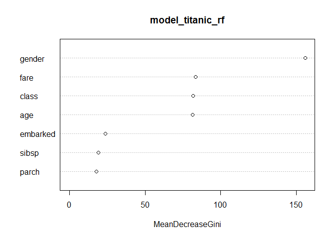

변수의 효과
-----------

-   Gender가 가장 중요한 변수

-   class, Age , Fare 가 그 다음 중요한 세가지 변수

-   모델의 반응과 이 변수들 사이의 관계를 보고자 한다.

-   "univariate relation" : can be calculated with ***variable\_response()***

### Passanger class

Passangers in the first class have much higher survival probability.

``` r
vr_class  <- variable_response(explain_titanic_rf, variable =  "class", type="factor")
plot(vr_class)
```

    ## Scale for 'x' is already present. Adding another scale for 'x', which
    ## will replace the existing scale.

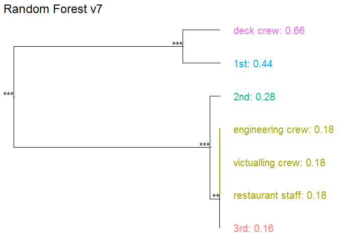

### Age

5살 이하의 어린이들이 살 확률이 더 높았다.

``` r
vr_age  <- variable_response(explain_titanic_rf, variable =  "age")
plot(vr_age, use_facets = TRUE)
```

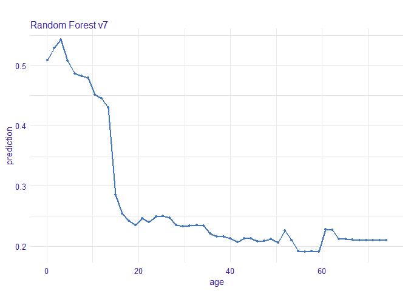

### Fare

가장 저렴한 티켓은 낮은 생존 확률과 연관되어 있다.

``` r
vr_fare  <- variable_response(explain_titanic_rf, variable =  "fare")
plot(vr_fare, use_facets = TRUE)
```

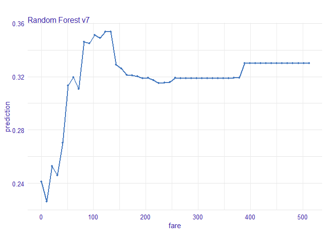

### Embarked

Cherbourg에서의 탑승객들이 가장 높은 생존을 보인다.

``` r
vr_embarked  <- variable_response(explain_titanic_rf, variable =  "embarked", type="factor")
plot(vr_embarked)
```

    ## Scale for 'x' is already present. Adding another scale for 'x', which
    ## will replace the existing scale.

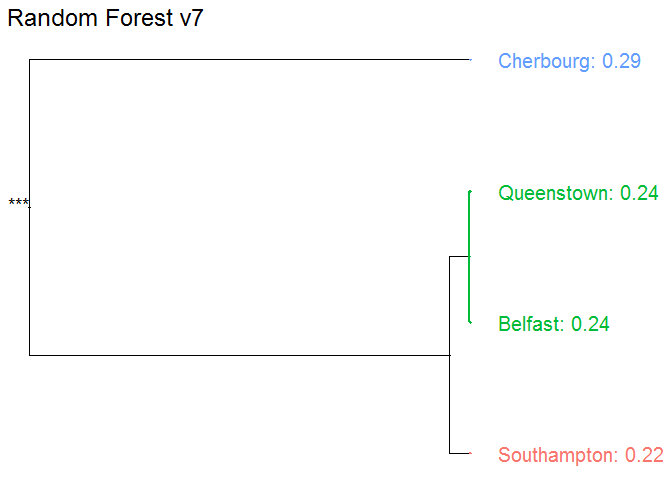

Instance level explanations
---------------------------

Let’s see break down explanation for model predictions for 8 years old male from 1st class that embarked from port C.

``` r
new_passanger <- data.frame(
  class = factor("1st", levels = c("1st", "2nd", "3rd", "deck crew", "engineering crew", "restaurant staff", "victualling crew")),
  gender = factor("male", levels = c("female", "male")),
  age = 8,
  sibsp = 0,
  parch = 0,
  fare = 72,
  embarked = factor("Southampton", levels = c("Belfast", "Cherbourg", "Queenstown", "Southampton"))
)

new_passanger %>% kable()
```

| class | gender |  age|  sibsp|  parch|  fare| embarked    |
|:------|:-------|----:|------:|------:|-----:|:------------|
| 1st   | male   |    8|      0|      0|    72| Southampton |

``` r
sp_rf <- single_prediction(explain_titanic_rf, new_passanger)
plot(sp_rf)
```

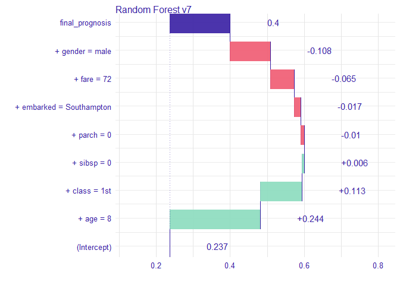

이 탑승객에게 가장 중요한 변수는 나이와 성별로 보인다. 전반적으로 이 탑승객의 생존 odds는 평균적인 탑승객보다 높음을 알 수 있다. 주된 요인은 남자임에도 어린 나이 때문인 것으로 생각된다.

다양한 모델들
-------------

### Logistic regression

``` r
model_titanic_lmr <- lrm(survived == "yes" ~ class + gender + rcs(age) + sibsp +
                           parch + fare + embarked, titanic)
explain_titanic_lmr <- explain(model_titanic_lmr, data = titanic, 
                               y = titanic$survived == "yes", 
                               predict_function = function(m,x) predict(m, x, type="fitted"),
                               label = "Logistic regression")
```

### Generalized Boosted Models (GBM)

``` r
model_titanic_gbm <- gbm(survived == "yes" ~ class + gender + age + sibsp +
                           parch + fare + embarked, data = titanic, n.trees = 15000)
```

    ## Distribution not specified, assuming bernoulli ...

``` r
explain_titanic_gbm <- explain(model_titanic_gbm, data = titanic, 
                               y = titanic$survived == "yes", 
                               predict_function = function(m,x) predict(m, x, n.trees = 15000, type = "response"),
                               label = "Generalized Boosted Models")
```

### Support Vector Machines (SVM)

``` r
model_titanic_svm <- svm(survived == "yes" ~ class + gender + age + sibsp +
                           parch + fare + embarked, data = titanic, 
                         type = "C-classification", probability = TRUE)
explain_titanic_svm <- explain(model_titanic_svm, data = titanic, 
                               y = titanic$survived == "yes", 
                               label = "Support Vector Machines")
```

### k-Nearest Neighbours (kNN)

``` r
model_titanic_knn <- knn3(survived == "yes" ~ class + gender + age + sibsp +
                            parch + fare + embarked, data = titanic, k = 5)
explain_titanic_knn <- explain(model_titanic_knn, data = titanic, 
                               y = titanic$survived == "yes", 
                               predict_function = function(m,x) predict(m, x)[,2],
                               label = "k-Nearest Neighbours")
```

### Variable performance

``` r
vi_rf <- variable_importance(explain_titanic_rf)
vi_lmr <- variable_importance(explain_titanic_lmr)
vi_gbm <- variable_importance(explain_titanic_gbm)
vi_svm <- variable_importance(explain_titanic_svm)
vi_knn <- variable_importance(explain_titanic_knn)

plot(vi_rf, vi_lmr, vi_gbm, vi_svm, vi_knn, bar_width = 4)
```

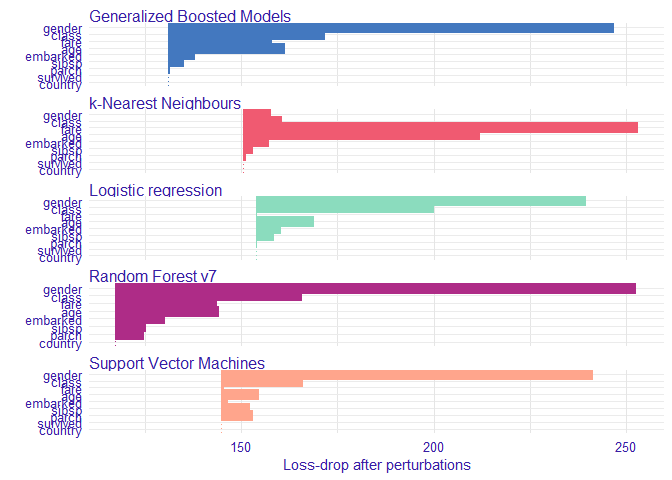

### Single variable

``` r
vr_age_rf  <- variable_response(explain_titanic_rf, variable =  "age")
vr_age_lmr  <- variable_response(explain_titanic_lmr, variable =  "age")
vr_age_gbm  <- variable_response(explain_titanic_gbm, variable =  "age")
vr_age_svm  <- variable_response(explain_titanic_svm, variable =  "age")
vr_age_knn  <- variable_response(explain_titanic_knn, variable =  "age")
plot(vr_age_rf, vr_age_lmr, vr_age_gbm, vr_age_svm, vr_age_knn)
```

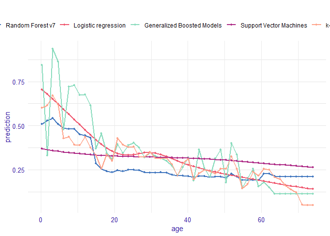

``` r
plot(vr_age_rf, vr_age_lmr, vr_age_gbm, vr_age_svm, vr_age_knn, use_facets = TRUE)
```

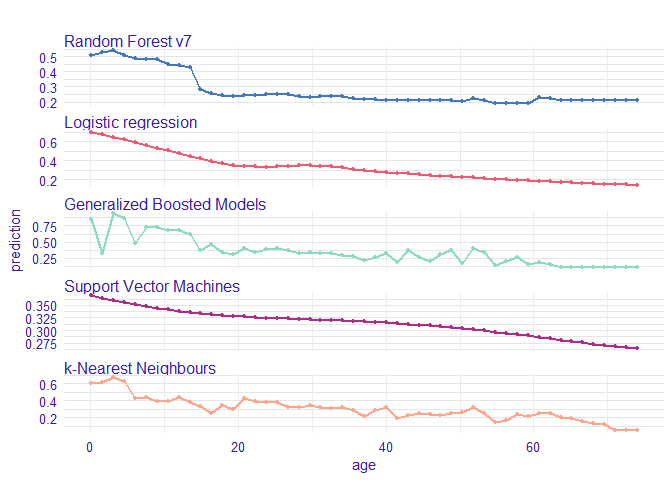

### Instance level explanations

``` r
sp_rf <- single_prediction(explain_titanic_rf, new_passanger)
sp_lmr <- single_prediction(explain_titanic_lmr, new_passanger)
sp_gbm <- single_prediction(explain_titanic_gbm, new_passanger)
sp_svm <- single_prediction(explain_titanic_svm, new_passanger)
sp_knn <- single_prediction(explain_titanic_knn, new_passanger)
plot(sp_rf, sp_lmr, sp_gbm, sp_svm, sp_knn)
```

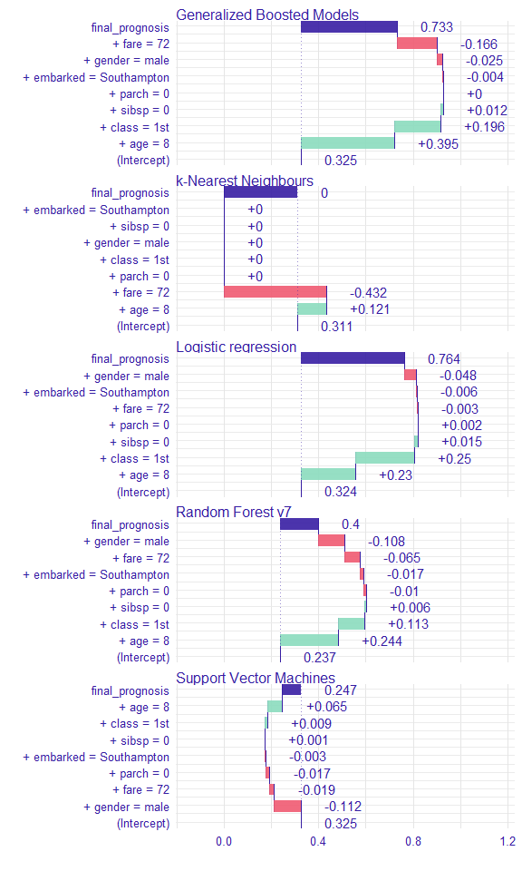

------------------------------------------------------------------------

#### 평소에 하던 모델링 결과 제시

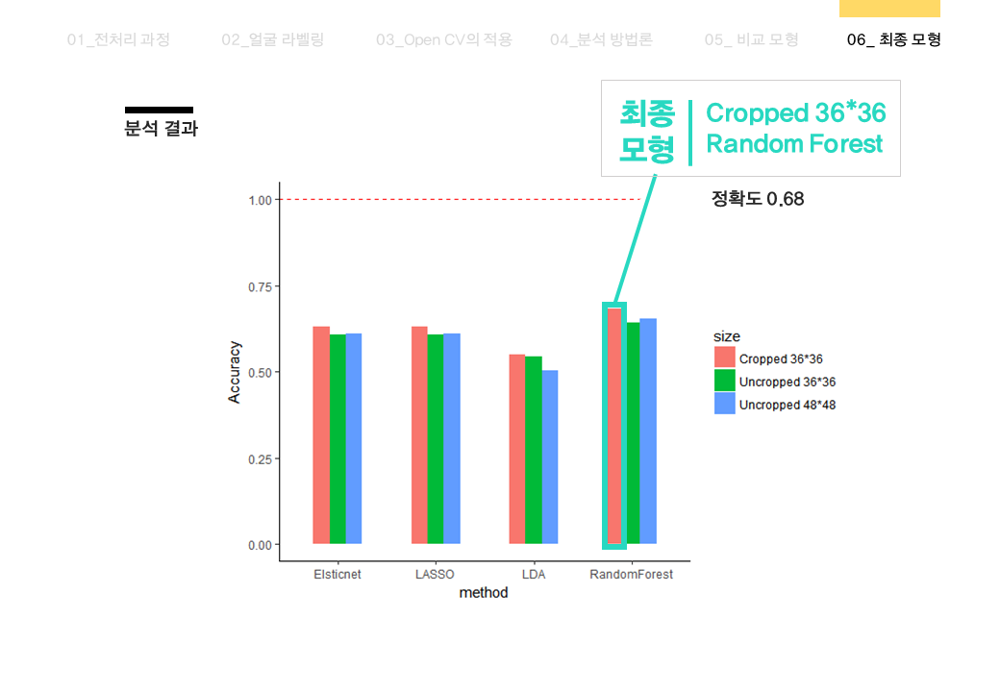


