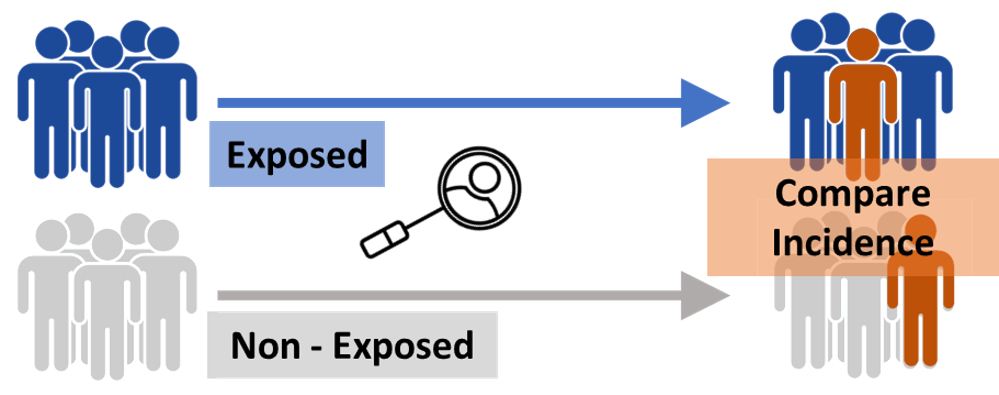
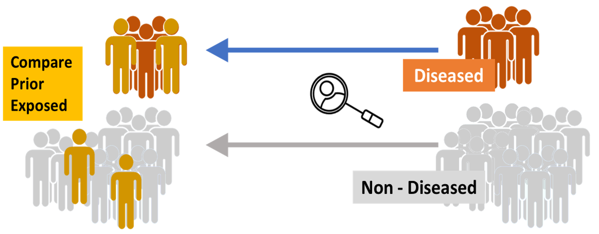
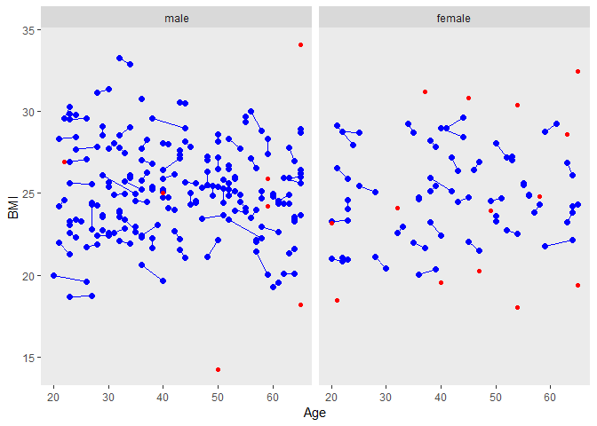
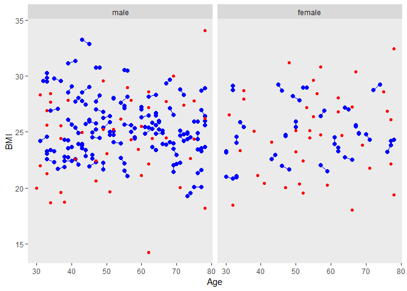
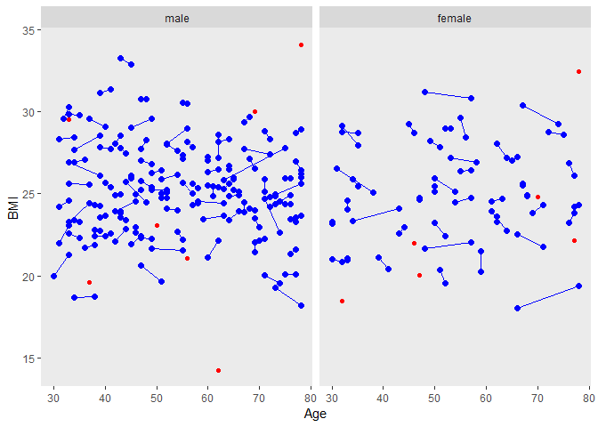

A case where prospective matching may limit bias in a randomized trial
================
Sunny
2019년 3월 25일

Cohort 연구의 경우 (전향적 연구)
--------------------------------



전향적 연구는 연구 시점에서 요인(치료, 위험인자)이 있는 사람과 없는 사람을 모아서, 결과 발생을 현 시점에서 시간의 경과와 더불어 추적해 가는 방법이다. 위험인자, 예후의 해석에 적합하다. Bias가 적은 것이 장점이지만 수고와 시간이 많이 걸린다.

Case Control 연구의 경우 (후향적 연구)
--------------------------------------



후향적 연구는 현재의 결과에서 시작되어 시간을 거슬러 올라가서 과거 요인의 유무를 해석하는 방법이다. 인과관계 발견에 적합하고, 노력이 적게 들지만, 연구자가 임의로 환자를 선택하게 되기 쉬워서 bias가 커지는 결점이 있다.

-   Case 군과 control 군의 base characteristics가 맞지 않음.

-   Case 군의 임상적 특징을 갖는 대상을 control 군 내에서 골라 Baseline 특성을 맞추어 주는 작업이 필요

-   If not, 선택 편향(selection bias) 발생


Matching의 필요성 예시
----------------------

-   과연 control을 어떻게 설정할 것인가? \*

Ex) 경구피임약이 유방암에 미치는 영향을 조사 시

    - Case: 유방암이 발생한 여성

    - Control : 유방암이 발생하지 않은 모든 여성

어린 초등학생들도 control 에 포함되어야 할까?

공변량(Covariate)들의 수준을 맞추어 통제한 후, 특정 독립변수가 종속변수에 미치는 영향의 정도를 제대로 파악할 수 있도록 하는 방법 : " PSM "

(공변량은 여러 변인들이 공통적으로 공유하는 변량을 의미)

Article summary : The matching strategy
---------------------------------------

-   Analysis is important, but study design is paramount.

-   1.  데이터에서 한 사람을 추출하여 나머지 사람들과 매칭시켜본다.

    -   매칭 시에 고려되는 공변량 : 연구자의 생각에 기초하여 선정

    -   such as age, gender, and one or two other relevant baseline measures.

-   2-1) 만약 매칭되는 사람이 없다면, 그 사람은 연구에서 제외.

-   2-2) 매칭되는 사람이 있다면, 첫 번째 개인은 therapy 그룹으로, 매칭된 사람은 control 그룹으로 배정

-   1.  모든 사람이 matched되었거나, unmatched 그룹으로 할당될 때 까지 반

Library
-------

``` r
library(dplyr)
library(data.table)
library(wakefield)
library(ggplot2)
library(knitr) 
library(Matching)
```

-   Matching Library  
    Multivariate and Propensity Score Matching with Balance Optimization

Data generation
---------------

300명의 simulated data를 생성 , ID와 성별(남자 70%, 여자 30%)과, 20세 부터 65세까지의 연령, BMI는 평균 25, 분산 3인 normal 분포 따르도록 생성

``` r
set.seed(1227)
dsamp <- r_data_frame(n = 300, 
                      id,
                      sex(x = c(0,1), 
                          prob = c(0.7,0.3),
                          name = "female"),
                      age(x = 20:65, 
                          name = 'Age'),
                      Scoring=rnorm(300,25,3))

colnames(dsamp) <- c("ID","female","Age","BMI")
dsamp$BMI <-round(dsamp$BMI, 2)
dsamp$female  <- as.numeric(dsamp$female)-1
dsamp <- dsamp %>% as.data.table()
dsamp %>% head %>% kable()
```

| ID  |  female|  Age|    BMI|
|:----|-------:|----:|------:|
| 001 |       0|   52|  25.63|
| 002 |       1|   50|  26.81|
| 003 |       1|   32|  24.09|
| 004 |       1|   59|  21.79|
| 005 |       0|   49|  24.88|
| 006 |       0|   62|  25.93|

The matching algorithm
----------------------

``` r
dsamp[, rx := 0]
dused <- NULL
drand <- NULL
dcntl <- NULL
set.seed(1227)
while (nrow(dsamp) > 1) {
  
  selectRow <- sample(1:nrow(dsamp), 1)
  
  dsamp[selectRow, rx := 1]
  
  myTr <- dsamp[, rx]
  myX <- as.matrix(dsamp[, .(female, Age, BMI)])
  
  match.dt <- Match(Tr = myTr, X = myX, 
                    caliper = c(0,0.5,0.5), ties = FALSE)
  # Ideally, we would want to have exact matches,
  # but this is unrealistic for continuous measures. 
  # So, for age and BMI, we set the matching range to be 0.5 standard deviations. 
  # (We do match exactly on gender.)
  
  if (length(match.dt) == 1) {  # no match
    
    dused <- rbind(dused, dsamp[selectRow])
    dsamp <- dsamp[-selectRow, ]
    
  } else {                      # match
    
    trt <- match.dt$index.treated
    ctl <- match.dt$index.control
    
    drand <- rbind(drand, dsamp[trt])
    dcntl <- rbind(dcntl, dsamp[ctl])
    
    dsamp <- dsamp[-c(trt, ctl)]
    
  }
}
```

Treatment 그룹에 할당된 데이터
------------------------------

``` r
drand %>% group_by(female) %>% summarize(mean_of_BMI = mean(BMI), count=n()) %>% kable
```

|  female|  mean\_of\_BMI|  count|
|-------:|--------------:|------:|
|       0|       25.21000|    102|
|       1|       24.96757|     37|

Control 그룹에 할당된 데이터
----------------------------

``` r
dcntl %>% group_by(female) %>% summarize(mean_of_BMI = mean(BMI), count=n())%>% kable()
```

|  female|  mean\_of\_BMI|  count|
|-------:|--------------:|------:|
|       0|       25.23196|    102|
|       1|       24.88054|     37|

만들어진 데이터 형태
--------------------

``` r
drand %>% head()%>% kable()
```

| ID  |  female|  Age|    BMI|   rx|
|:----|-------:|----:|------:|----:|
| 119 |       0|   32|  23.91|    1|
| 212 |       1|   39|  20.36|    1|
| 245 |       0|   21|  28.34|    1|
| 036 |       1|   23|  23.35|    1|
| 086 |       1|   37|  21.66|    1|
| 113 |       0|   35|  22.65|    1|

``` r
dcntl %>% head()%>% kable()
```

| ID  |  female|  Age|    BMI|   rx|
|:----|-------:|----:|------:|----:|
| 100 |       0|   32|  23.93|    0|
| 256 |       1|   36|  20.05|    0|
| 257 |       0|   24|  28.42|    0|
| 186 |       1|   20|  23.29|    0|
| 211 |       1|   35|  22.00|    0|
| 260 |       0|   35|  22.96|    0|

treatment 그룹과 control 그룹의 짝을 연결
-----------------------------------------

-   mtanum이라는 변수를 이용

-   dused는 매칭되지 않은 데이터

``` r
drand$matnum <- c(1:dim(drand)[1])
dcntl$matnum <- c(1:dim(dcntl)[1])

dused1 <- dused
dused1$matnum <-NA
```

``` r
tt <- bind_rows(as.data.frame(drand),as.data.frame(dcntl))
tt %>% arrange(matnum) %>% head %>% kable()
```

| ID  |  female|  Age|    BMI|   rx|  matnum|
|:----|-------:|----:|------:|----:|-------:|
| 119 |       0|   32|  23.91|    1|       1|
| 100 |       0|   32|  23.93|    0|       1|
| 212 |       1|   39|  20.36|    1|       2|
| 256 |       1|   36|  20.05|    0|       2|
| 245 |       0|   21|  28.34|    1|       3|
| 257 |       0|   24|  28.42|    0|       3|

``` r
labels <- c("0" = "male", "1" = "female")

ggplot(tt,aes(Age, BMI, group=matnum))+
  geom_point(size=2, colour="blue")+
  geom_line(colour="blue")+ facet_grid( ~ female, labeller=labeller(female = labels))+
  theme(panel.grid.major = element_blank(), panel.grid.minor = element_blank())+
  geom_point(data=dused1, aes(Age, BMI, group=matnum),color="red")
```



### male의 trt vs control group 비교

``` r
tt %>% filter(female==0) %>% 
  group_by(rx) %>% 
  summarize(count=n(),mu.age=mean(Age),sd.age=sd(Age),mu.BMI=mean(BMI),sd.BMI=sd(Age))%>%
  kable()
```

|   rx|  count|    mu.age|    sd.age|    mu.BMI|    sd.BMI|
|----:|------:|---------:|---------:|---------:|---------:|
|    0|    102|  42.56863|  13.08049|  25.23196|  13.08049|
|    1|    102|  42.51961|  13.51620|  25.21000|  13.51620|

### female의 trt vs control group 비교

``` r
tt %>% filter(female==1) %>% 
  group_by(rx) %>% 
  summarize(count=n(),mu.age=mean(Age),sd.age=sd(Age),mu.BMI=mean(BMI),sd.BMI=sd(Age))%>%
  kable()
```

|   rx|  count|    mu.age|    sd.age|    mu.BMI|    sd.BMI|
|----:|------:|---------:|---------:|---------:|---------:|
|    0|     37|  41.94595|  13.85028|  24.88054|  13.85028|
|    1|     37|  41.62162|  13.39227|  24.96757|  13.39227|

The distributions of the matching variables (or least the means and standard deviations) appear quite close, as we can see by looking at the males and females separately.

caliper values 에 따른 비교
---------------------------

#### 1. caliper = c(0,0.5,0.5) ⇒ c(0,0.2,0.2)

We could get shorter line segments if we reduced the caliper values, but we would certainly increase the number of unmatched patients.

``` r
set.seed(1227)
dsamp <- r_data_frame(n = 300, 
                      id,
                      sex(x = c(0,1), 
                          prob = c(0.7,0.3),
                          name = "female"),
                      age(x = 30:78, 
                          name = 'Age'),
                      Scoring=rnorm(300,25,3))

colnames(dsamp) <- c("ID","female","Age","BMI")
dsamp$BMI <-round(dsamp$BMI, 2)
dsamp$female  <- as.numeric(dsamp$female)-1
dsamp <- dsamp %>% as.data.table()

dsamp[, rx := 0]
dused <- NULL
drand <- NULL
dcntl <- NULL


set.seed(1227)
while (nrow(dsamp) > 1) {
  selectRow <- sample(1:nrow(dsamp), 1)
  dsamp[selectRow, rx := 1]
  myTr <- dsamp[, rx]
  myX <- as.matrix(dsamp[, .(female, Age, BMI)])
  
  match.dt <- Match(Tr = myTr, X = myX, 
                    caliper = c(0,0.2,0.2), ties = FALSE)
  
  if (length(match.dt) == 1) {  # no match
    dused <- rbind(dused, dsamp[selectRow])
    dsamp <- dsamp[-selectRow, ]
  } else {                      # match
    trt <- match.dt$index.treated
    ctl <- match.dt$index.control
    drand <- rbind(drand, dsamp[trt])
    dcntl <- rbind(dcntl, dsamp[ctl])
    dsamp <- dsamp[-c(trt, ctl)]
  }
}

drand$matnum <- c(1:dim(drand)[1])
dcntl$matnum <- c(1:dim(dcntl)[1])

dused1 <- dused
dused1$matnum <-NA
tt <- bind_rows(as.data.frame(drand),as.data.frame(dcntl))
labels <- c("0" = "male", "1" = "female")

ggplot(tt,aes(Age, BMI, group=matnum))+
  geom_point(size=2, colour="blue")+
  geom_line(colour="blue")+ facet_grid( ~ female, labeller=labeller(female = labels))+
  theme(panel.grid.major = element_blank(), panel.grid.minor = element_blank())+
  geom_point(data=dused1,aes(Age, BMI, group=matnum),color="red")
```



#### 2. caliper = c(0,0.5,0.5) ⇒ c(0,0.9,0.9)


